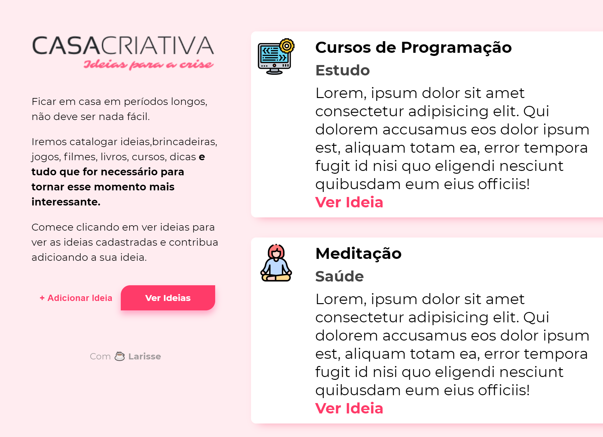
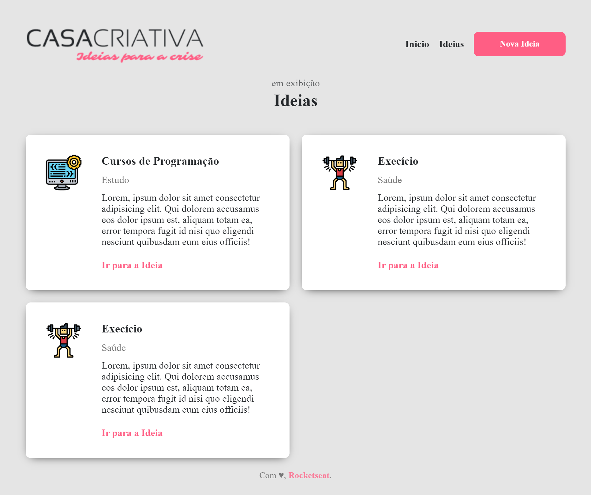
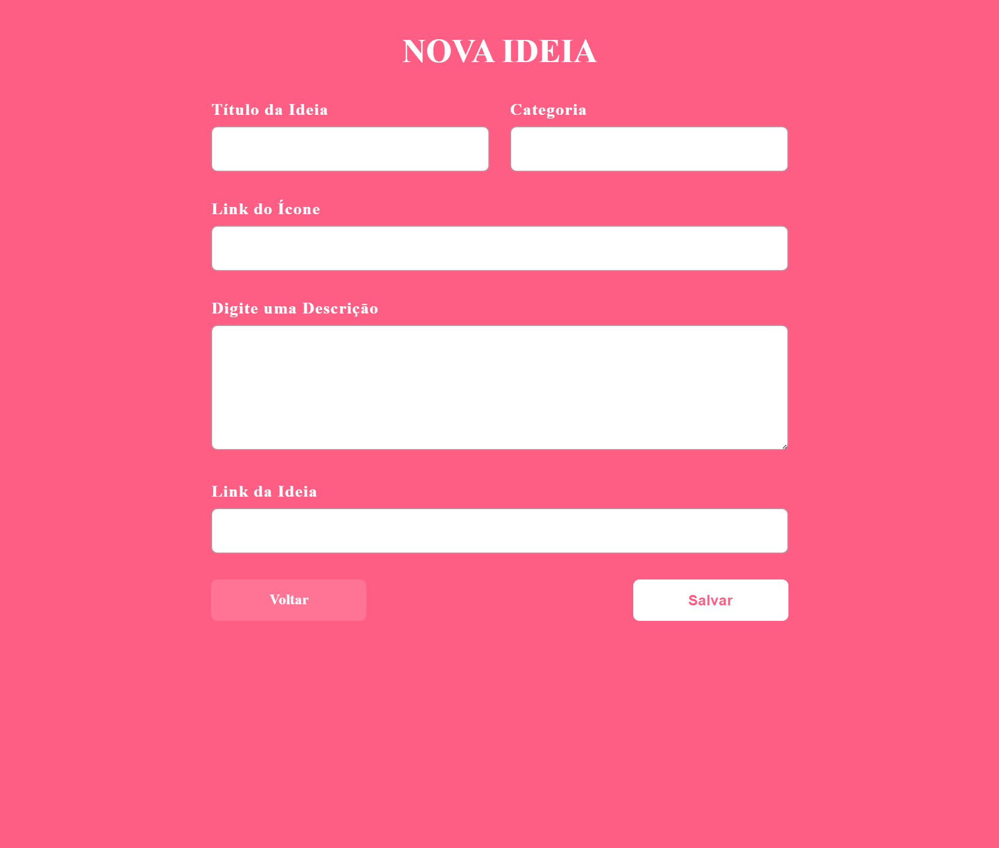

<h2 align="center">WorkshopDev Especial Rocketseat</h2>

Página de web criada para armazenar sugestões de atividades que podem ser realizadas durante a quarentena. 

Linguagens utilizadas:
HTML 
CSS 
Javascript 
Express 
Nunjucks 
Nodemon 
SQLite 
Node.js 

[ LinkedIn ](https://www.linkedin.com/in/larisselima/)

<h3 align="center">Desenvolvido por Larisse Lima :coffee: </h3>
